# Házi feladat specifikáció

Információk [itt](https://viaumb02.github.io/laborok/android/A01/)

## Mobilszoftver Laboratórium
### 2025 tavaszi félév
### Nagy Dániel - (UU5SCQ)
### Laborvezető: Pomázi Krisztián

## GymDex

## Bemutatás

A GymDex alkalmazás egy egyszerű, gyorsan elérhető és használható edzőtermi gyakorlat katalógus.

Amikor valaki először veszi rá magát az edzőtermi edzésre és kicsit utánna néz, hogy mégis mit is kéne ott csinálnia, sokszor rengeteg információt, ezernyi különböző gyakorlatot zúdítanak a nyakába a különböző fitnesz influenszerek, ráadásul sokszor csak a gyakorlat nevét említik különösebb iránymutatás nélkül. Ez az alkalmazás nekik hivatott segíteni azáltal, hogy gyors információforrást biztosít sok, gyakran látott edzőtermi gyakorlatra vonatkozóan.

Az alkalmazás persze egy kicsivel tapasztaltabb kondisnak is segítség lehet. Például amikor délután 4-kor, csúcsidőben foglalt a kedvenc mellizom gépe és gyorsan keresni akar egy alternatívát.

## Főbb funkciók

Az alkalmazás minden felhasználója ugyanazokat a funkciókat, ugyanolyan jogosultságokkal éri el (egyféle actor létezik).

A teljes applikáció 3 főbb képernyőből áll, továbbá plusz 2 képernyő szolgál a találatok keresésére, szűrésére. Megnyitáskor egy "About" képernyő fogadja a felhasználót, ahonnan egy izomcsoportot kiválasztva át lehet navigálni a második, gyakorlatokat listázó képernyőre. A listázó nézetből lehetőség van átnavigálni az egyes gyakorlatok részletes nézetére.

A gyakorlatokat az alkalmazás a [wger](https://exercise.hellogym.io/ru/software/api) API-ról kéri le, majd egy room adatbázisban tárolja azokat az offline használat támogatásához.

*Az egyes képernyőkön elérhető funkciókról részletes leírás alább található.*

### About képernyő

A felhasználó:
- Egy rövid üdvözlő üzenetet lát a képernyőn.
- Leljebb görgetve listázva látja a főbb izomcsoportokat.
- Az izomcsoport kiválasztásával át tud navigálni az adott izomcsoporthoz tartozó gyakorlatok listázó képernyőjére.

    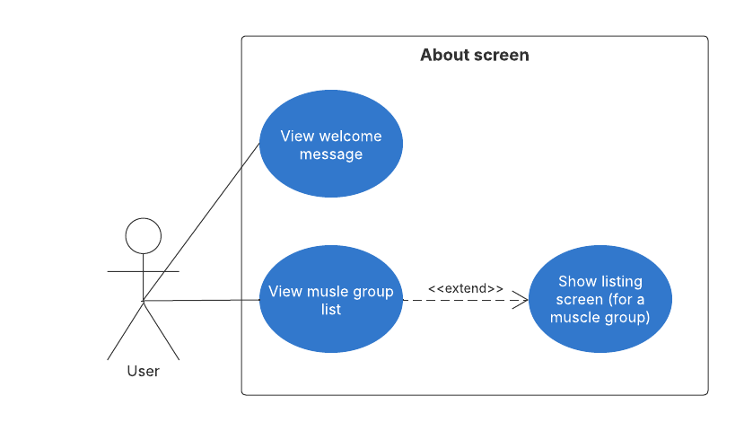

### Listázó képernyő

A felhasználó:
- Vissza tud lépni az About képernyőre.
- Görgethető listában látja a megjelenített gyakorlatok neveit.
- A keresés ikonra bökve át tud navigálni a kereső képernyőre ahol név szerint tud keresni a gyakorlatok között.
- A szűrés ikonra bökve át tud navigálni a szűrésért felelős képernyőre ahol szűrni tudja a megjelenített gyakorlatokat az alábbiak szerint:
    - Izomcsoport (kötelező)
    - A gyakorlat végrehajtásához szükséges segédeszköz
    - Kedvenc gyakorlatok
- Egy konkrét gyakorlatra rábökve átnavigálhat az adott gyakorlat részletes nézetére.

    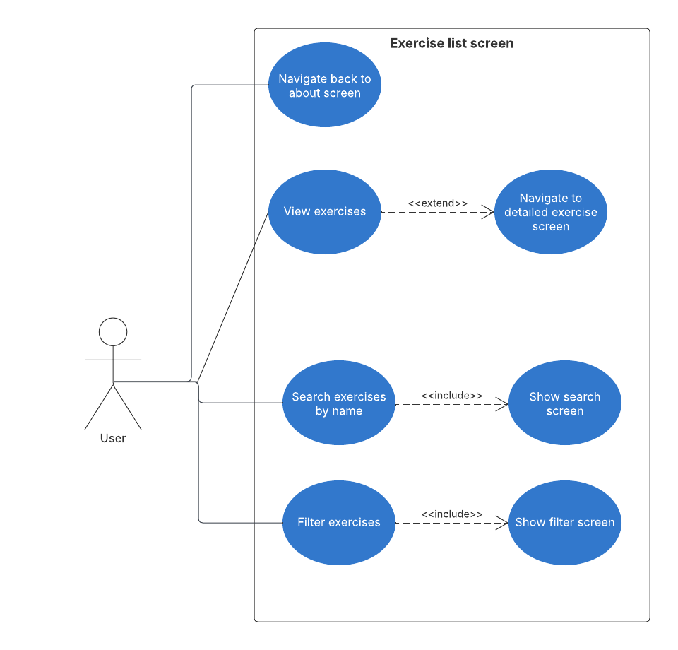

    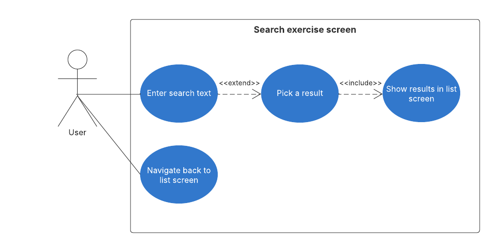

    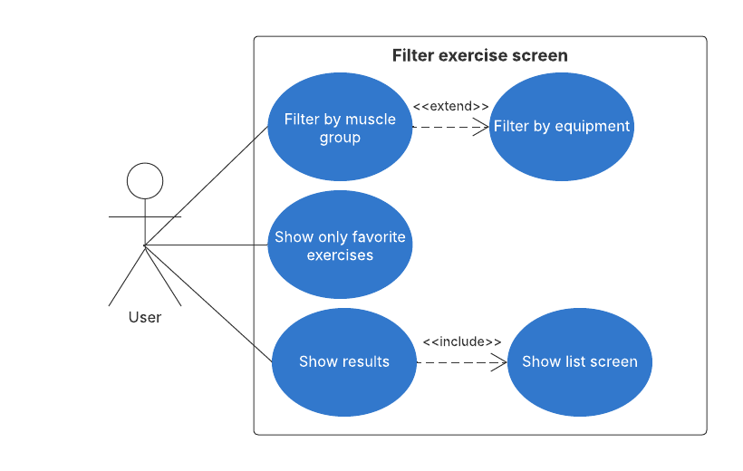

### Gyakorlat részletező képernyő

A képernyőn a következő részletes információk találhatók meg a kiválasztott gyakorlatról:
- Rövid leírás a gyakorlatról, annak végrehajtásáról.
- A gyakorlat végrehajtásához szükséges segédeszközök listája.
- Fényképes segítség a helyes végrehajtáshoz (amennyiben az adatbázis rendelkezik ilyennel az adott gyakorlathoz).

A felhasználó:
- El tudja menteni a kiválasztott gyakorlatot a kedvencek közé.
- Vissza tud lépni a listázó nézetre

    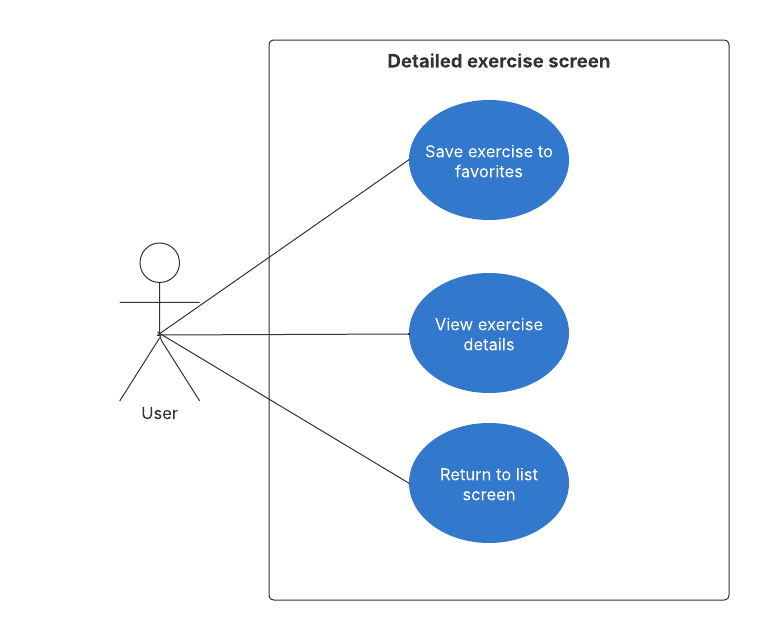

## Képernyőtervek

### Nyitó képernyő

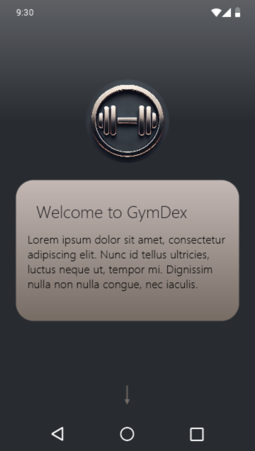 | 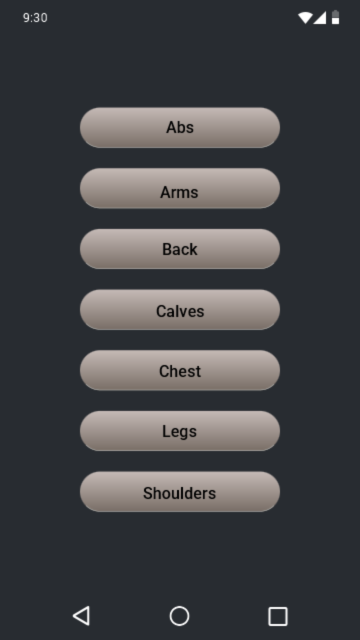
:-------------------------:|:-------------------------:

### Listázó képernyő
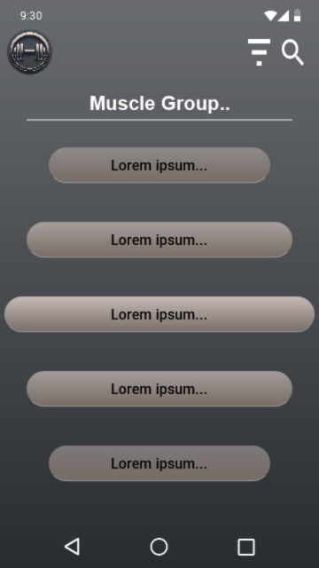

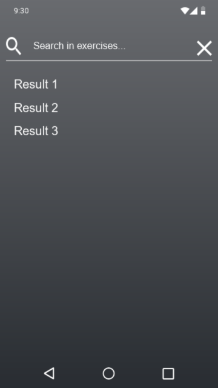 | 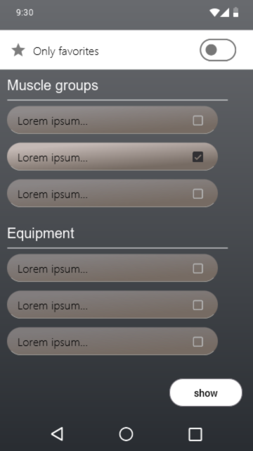
:-------------------------:|:-------------------------:

### Gyakorlat részletező képernyő
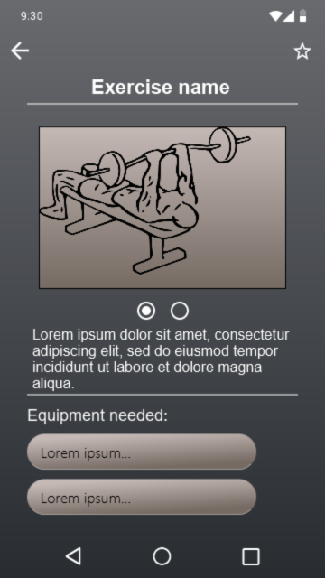

## Architektúra skeleton
Az alkalmazás az MVVM (Model-View-Viewmodel) architektúra szerint épül fel, ez röviden azt jelenti, hogy 3 fő feladatkört, vagy réteget lehet elkülöníteni:
- A model rétegben található a háttérlogika. (ide tartozik a perzisztens adattárolás, hálózati kommunikáció stb.. megvalósítása). Lényegében az adatkezelés.
- A view (nézet) réteg csupán a megjelenítésért felel amihez az alkalmazás Compose-t használ.
- A viewmodel réteg az architektúra fő sajátossága, ami a lényegében az előző két réteget köti össze, biztosítja a hozzá tartozó view számára a megjelenítendő adatokat.

Az mvvm legfőbb előnye, hogy helyes implementáció esetén átlátható kódbázis fejlesztését teszi lehetővé, jól elkülöníti a feladatköröket. Az architektúra szintén megkönnyíti az üzleti logika tesztelését, ráadásul jól illeszkedik a compose és hilt használatához.

### Képernyő képek - Commitok:

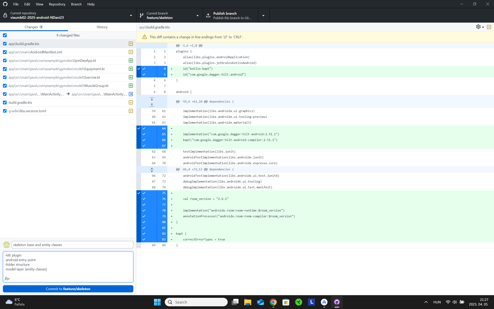  |  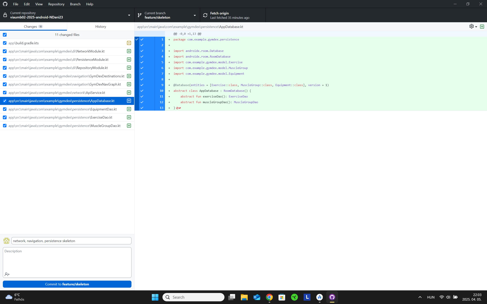
:-------------------------:|:-------------------------:
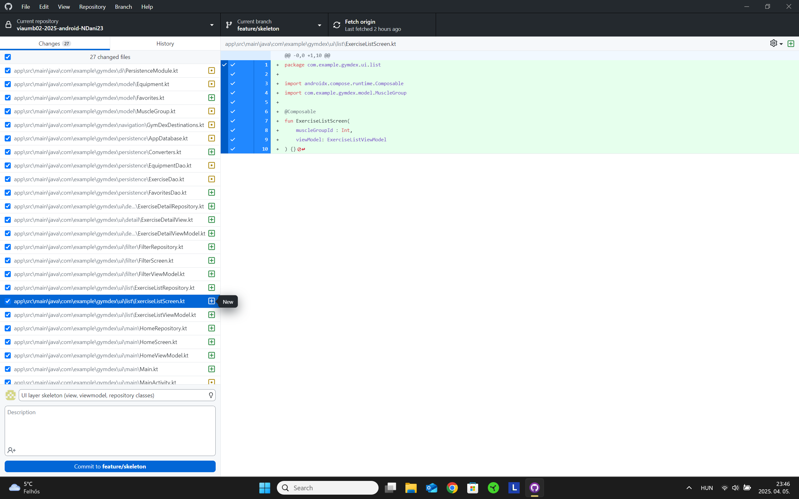  |  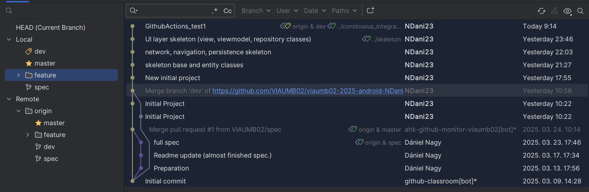

### Képernyő képek - Github Actions:

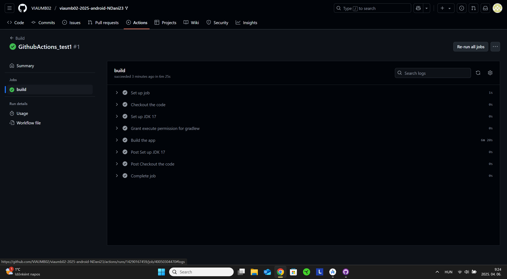  |  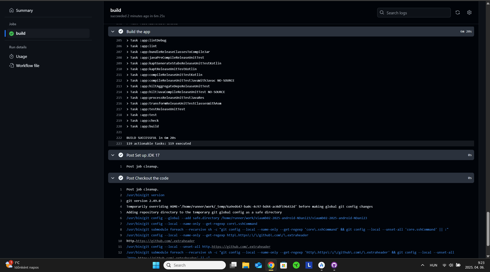
:-------------------------:|:-------------------------:

## Hálózati réteg
Az alkalmazásban megjelenített adatokat a [wger](https://exercise.hellogym.io/ru/software/api) API nyújtja, ami egy ingyenesen elérhető edzőtermi gyakorlatokat és egyéb, edzéshez köthető adatokat tároló adatbázis. Fontos megjegyezni, hogy ez az API engedélyezi az adatok lokális tárolását (cachelését) is, ami elengedhetetlen a GymDex alkalmazás felhasználó barát működéséhez.

A hálózati réteg legfontosabb osztályai a "Network" modulban találhatók.

### ApiService osztály
Ez az osztály valósítja meg a hálózati hívásokat az API felé a retrofit könyvtár használatával. Az osztály 4 különböző GET hívás végrehajtását támogatja:
- fetchMuscleGroupList: Lekéri az adatbázisban tárolt izomcsoportokat, amiket később a kezdő képernyőn fogok megjeleníteni.
- fetchEquipmentList: Az adatbázisban tárolt edzőtermi segédeszközök lekérdezését végzi, ezt a szűrés funkció implementálásánál fogom használni, illetve gyakorlatok megjelenítésénél is szükséges lesz.
- fetchExerciseList: A gyakorlatok lekérdezése. A [wger](https://exercise.hellogym.io/ru/software/api) API több különböző nyelven is elérhetővé tesz gyakorlatokat, így egy fixen beégetett Query paraméter gondoskodik róla, hogy csak az angol nyelvű gyakorlatokat fetcheljük. A másik query paraméter (status=2) azt határozza meg, hogy csak a verifikált, az API üzemeltetői álltal leellenőrzött gyakorlatok jelenjenek meg a válaszban.
- fetchExerciseImagesById: Egy adott gyakorlathoz tartozó szemléltető képek lekérdezése. Sajnos az API külön végponton ad hozzáférést a gyakorlatok képeihez, ami kis bonyodalmakat vet fel. Az alkalmazás szempontjából csak az angol nyelvű és az elfogadott státuszú gyakorlatok az érdekesek (Különböző nyelven lehetségesek különböző gyakorlatok) így nincs értelme az összes képet eltárolni, query paraméterek segítségével pedig nem lehetséges kiszűrni a megfelelő képeket. Emiatt "lazy loading"-ot alkalmazok, tehát csak akkor kérem le a gyakorlathoz tartozó képet, amikor annak a részletező képernyőjére navigál a felhasználó.

### Response osztályok
Az API minden GET végpontja lapokra tördelve ad választ a következő struktúra szerint:\
 "count":\
 "next":\
 "previous":\
 "results": []\
 Ebből a tényleges adat a "results" tömbben található. A response osztályok illeszkednek erre a struktúrára, így a hálózati hívások eredményeit tárolják átmenetileg.

 ## ORM Réteg
 Az alkalmazás egy ROOM adatbázisban tárolja az API-tól lekért adatokat. Ennek egyik előnye, hogy az adatbázisból való adatelérés sokszor hatékonyabb, mint a hálózati hívások, illetve lehetőséget ad az alkalmazás offline használatára. Az adatbázis kezelését végző osztályok a Model és a Persistence modulokban találhatók.

 ### Model osztályok
 A model modulban található Equipment, Exercise, MuscleGroup adat osztályok (Entity) definiálják a room adatbázis tábláinak felépítését (oszlopait).

 ### AppDatabase osztály
 Definiálja a room adatbázis felépítését, számon tartja annak verzióját, lényegében ez az osztály felelős magának az adatbázisnak az elkészítéséért.

 ### Converters osztály
 Az API-tól érkező válaszok gyakran használnak tömbbös formátumot, amit alapvetően nem tud kezelni a room adatbázis. Ezért szükség van átalakító függvényekre amik képesek értelmezni az ilyen jellegű JSON mezőket. A konverter osztályt az adatvázis létrehozásánál kötöm be az AppDatabase osztályban.

 ### DAO osztályok
 Az adatbázis minden táblájához tartozik egy DAO (Data access object) osztály, ami a táblán elvégezhető műveleteket definiálja és valósítja meg. Ezeken az osztályokon keresztül lehet hozzáférni az adatbázis tábláihoz pl. a repositorykban, legyen szó adatokat beszúrásáról, módosításáról, vagy lekérdezéséről. Például a szűrés funkció megvalósítása (backend részről) az ExerciseDAO egyik metódusa.

 ### Dependency Injection és Repository
A Repository osztályok állítják elő az adatot, amit aztán akár egy-vagy több viewmodel is felhasználhat. Lényegében ezekben az osztályokban használom fel a fentebb részletezett ApiService és DAO osztályokat. Az adatok előállítása szinte az összes repositoryban ugyanazt a sémát követi, először a DAO osztályokat felhasználva megnézem, hogy a lokális adatbázis tartalmazza-e már azt az adatot, amit repositorynak tovább kell adnia. Ha nem, akkor az ApiService osztályban megvalósított hálózati hívások segítségével lekérem az adatokat az API-tól, majd elmentem azokat (a DAO-kon keresztül) a lokális adatbázisba.

A repositorykhoz Dependency Injection (Hilt könyvtár) segítségével kötöm be az azok által használt ORM és Network rétegbeli osztályokat. A Hilt által injektálható objektumokat tehát a DI modulban példányosítom. Ide tartoznak többek között a DAO, ApiService, AppDatabase osztályok. A "Provide" annotáció gondoskodik róla, hogy a repositorykban egyszerűen elérhetők legyenek ezek az objektumok dependency injection használatával.

## Bemutató videó:
https://youtu.be/9ME6gIS9Kd4

## Tesztelés
Az alkalmazás háttérlogikájának helyes működését egység(Unit) tesztek implementálásával végeztem. A tesztelés során a hálózati, illetve az ORM réteg működését vizsgáltam.

### Hálózati réteg teszt stratégia
A hálózati réteg unit tesztelése során egy mockolt webszerver felé indítottam kéréseket, amikre a mockolt szerver előre definiált válaszokat "küldött vissza". A válasz üzenetek struktúrája teljes mértékben megegyezik a valódi API által használt formátummal. Ezek a tesztek azt hivatottak ellenőrizni, hogy a visszakapott json formátumú válaszokat helyesen tudja-e feldolgozni a hálózati réteg. Az alkalmazás csak GET kéréseket használ, így lényegében a tesztek azt ellenőrzik, hogy a kérést követően helyesen jönnek-e létre az adott objektumok. Az alkalmazás hálózati rétege 4 különböző GET hívást definiál, mindegyikhez 2 teszt tartozik. Az egyik teszt mindig a helyes és elvárt válaszüzenet megfelelő kezelését vizsgálja, míg a másik teszt leellenőrzi, hogy helyesen kezeli-e le az adott metódus a hibaüzenetet tartalmazó válaszokat (pl.: 404 Not Found).

### ORM réteg teszt stratégia
Az ORM réteg tesztelése során a 3 különböző DAO osztály (muscleGroup, Exercise, Equipment) metódusait teszteltem végig. Az adatbázison végzett metódusok teszteléséhez minden táblánál mockolt adatokat használtam. Ez azt jelenti, hogy minden tábla tartalmát előre definiáltam egy-egy lista objektumban a MockTestUtil.kt file-ban. A tesztek során ezeket a listákat szúrom be a teszt adatbázisba. A paraméterekkel rendelkező adatbázis műveleteknél külön figyelmet fordítottam rá, hogy a paraméterek helyes, illetve helytelen megadására is jól reagáljon az adott művelet. Az exerciseDAO osztályban található, szűrést megvalósító "filterExercises" metódus például több különböző paraméter értéket is vár, így a következő teszt eseteket definiáltam ennél a műveletnél:

- filterExercisesByFavorite (Csak kedvenc gyakorlatok helyes szűrése)
- filterExercisesByEquipmentTest (Csak a megadott segédeszközt tartalmazó gyakorlatok szűrése)
- filterExercisesByMuscleGroupTest (Csak a megadott izomcsoportba tartozó gyakorlatok szűrése)
- filterExercisesMultipleParamTest (Helyes szűrés több megadott paraméterre, pl.: szűrés egyszerre kedvenc státusz és segédeszköz szerint)
- filterExercisesNoMatchTest (Helyes viselkedés tesztelése abban az esetben, ha egy gyakorlat sem tesz eleget a szűrési feltételeknek)

### Sikeres teszt futások:
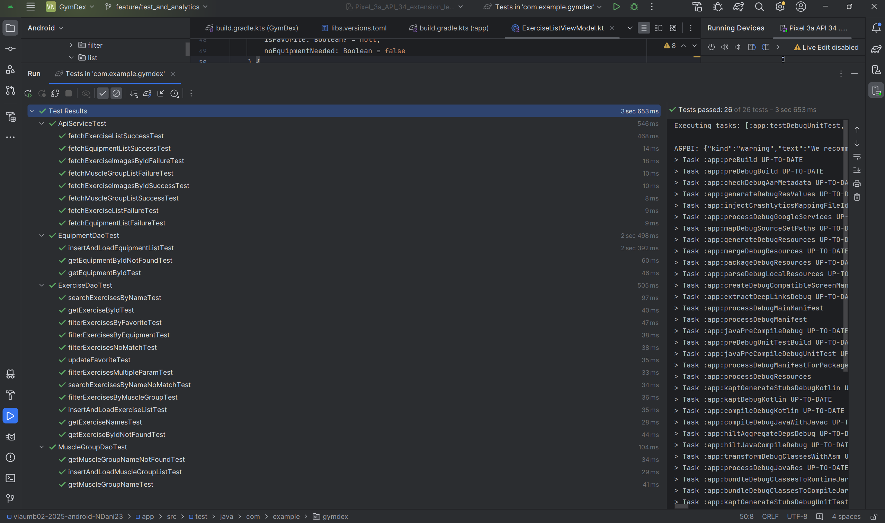

## Analitika (Google Analytics):
Saját egyedi analitikai esemény: Egy user elment egy gyakorlatot a kedvencei közé.

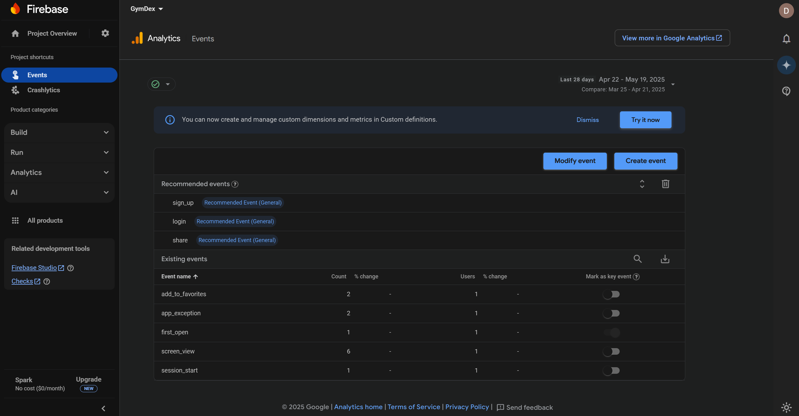

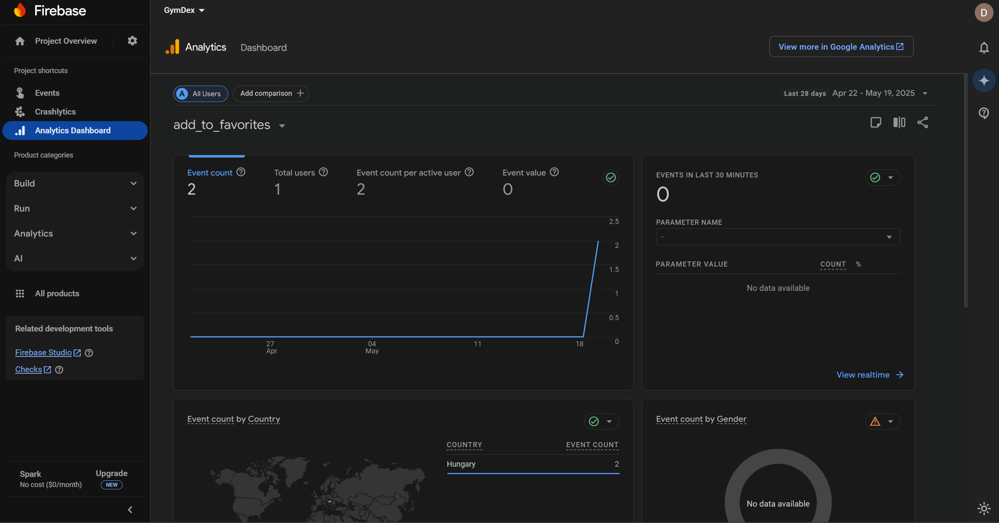

## Crash report:

Futási idejű hiba előállítása a Firebase BaaS Crashlytics funkciójának tesztelésére (RuntimeException dobása 2 különböző helyen):

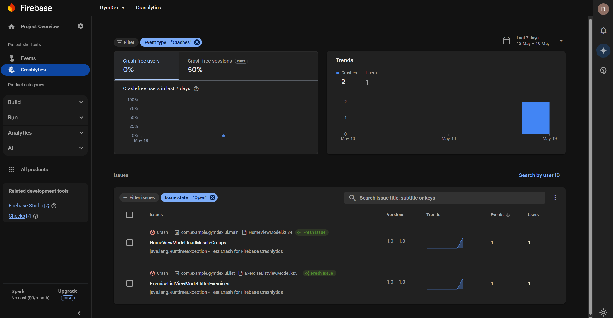

